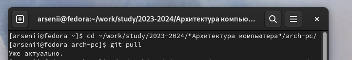
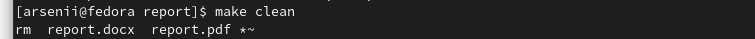

---
## Front matter
title: "Лабораторная работа №3"
subtitle: "Язык разметки Markdown"
author: "Бунин Арсений Викторович"

## Generic otions
lang: ru-RU
toc-title: "Содержание"

## Bibliography
bibliography: bib/cite.bib
csl: pandoc/csl/gost-r-7-0-5-2008-numeric.csl

## Pdf output format
toc: true # Table of contents
toc-depth: 2
lof: true # List of figures
lot: true # List of tables
fontsize: 12pt
linestretch: 1.5
papersize: a4
documentclass: scrreprt
## I18n polyglossia
polyglossia-lang:
  name: russian
  options:
	- spelling=modern
	- babelshorthands=true
polyglossia-otherlangs:
  name: english
## I18n babel
babel-lang: russian
babel-otherlangs: english
## Fonts
mainfont: PT Serif
romanfont: PT Serif
sansfont: PT Sans
monofont: PT Mono
mainfontoptions: Ligatures=TeX
romanfontoptions: Ligatures=TeX
sansfontoptions: Ligatures=TeX,Scale=MatchLowercase
monofontoptions: Scale=MatchLowercase,Scale=0.9
## Biblatex
biblatex: true
biblio-style: "gost-numeric"
biblatexoptions:
  - parentracker=true
  - backend=biber
  - hyperref=auto
  - language=auto
  - autolang=other*
  - citestyle=gost-numeric
## Pandoc-crossref LaTeX customization
figureTitle: "Рис."
tableTitle: "Таблица"
listingTitle: "Листинг"
lofTitle: "Список иллюстраций"
lotTitle: "Список таблиц"
lolTitle: "Листинги"
## Misc options
indent: true
header-includes:
  - \usepackage{indentfirst}
  - \usepackage{float} # keep figures where there are in the text
  - \floatplacement{figure}{H} # keep figures where there are in the text
---

# Цель работы

Целью работы является освоение процедуры оформления отчетов с помощью легковесного
языка разметки Markdown.

# Задание

1. В соответствующем каталоге сделать отчёт по лабораторной работе № 3 в формате
Markdown. В качестве отчёта необходимо предоставить отчёты в 3 форматах: pdf, docx
и md.
2. Загрузить файлы на github

# Теоретическое введение

Чтобы создать заголовок, используем #. Для полужирного начертания записываем текст так `**текст**`, для курсивного `*текст*`, для полужирного и курсивного `***текст***`.
Блок цитирования создается с помощью символа >.

Создание списков:
Упорядоченный список оформляется с помощью цифр, неупорядоченный - с помощью звездочек или тире. Для дочернего списка сделать отступы.

Встроенная ссылка состоит из текста гиперссылки, который мы заключаем в квадратные скобки, и URL-фдреса или имени файла, на который дается ссылка. Его заключаем в круглые скобки.

# Выполнение лабораторной работы

Открываем терминал и переходим в каталог курса (рис. @fig:fig1).

{#fig:fig1 width=70%}

Обновляем каталог курса (рис. @fig:fig2).

{#fig:fig2 width=70%}

Переходим в каталог с шаблоном отчета по лабораторной работе № 3 (рис. @fig:fig3).

{#fig:fig3 width=70%}

Выполняем команду make (рис. @fig:fig4).

{#fig:fig4 width=70%}

Проверяем наличие файлов (рис. @fig:fig5)

{#fig:fig5 width=70%}

Удаляем файлы  (рис. @fig:fig6)

{#fig:fig6 width=70%}

Проверяем, что файлы удалены  (рис. @fig:fig7)

{#fig:fig7 width=70%}

# Выводы

Освоили процедуры оформления отчетов с помощью легковесного языка разметки Markdown. Научились оформлять отчёты в формате Markdown и генерировать их в формат pdf и docx.

# Список литературы{.unnumbered}

::: {#refs}
:::
