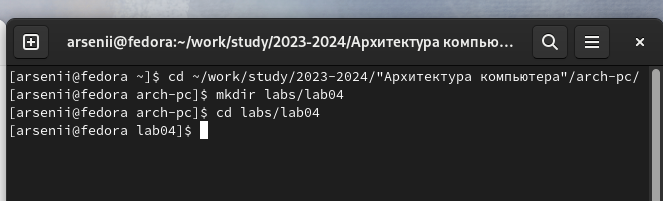
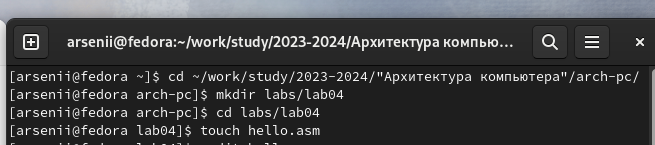
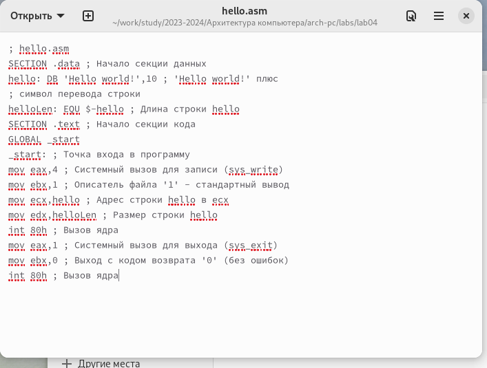
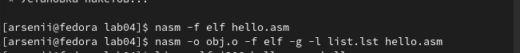
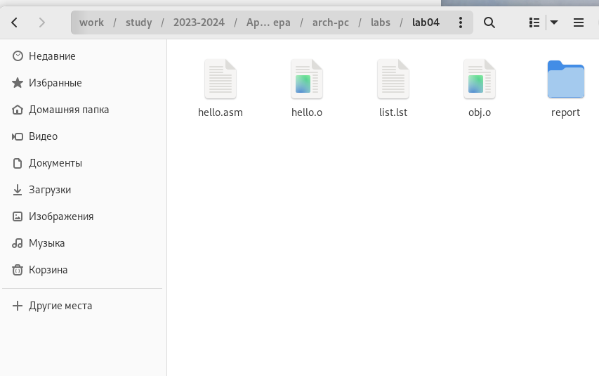
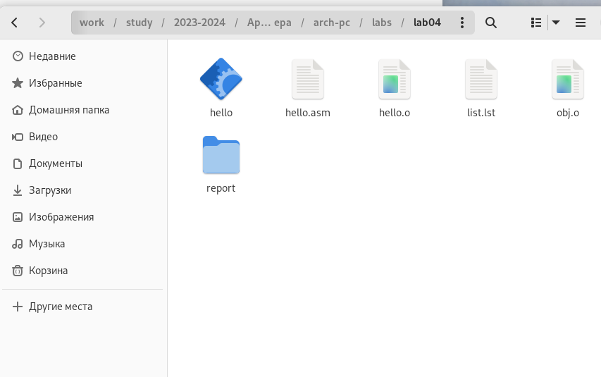
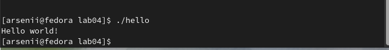

---
## Front matter
title: "Лабораторная работа №4"
subtitle: "Создание и процесс обработки программ на языке ассемблера NASM"
author: "Бунин Арсений Викторович"

## Generic otions
lang: ru-RU
toc-title: "Содержание"

## Bibliography
bibliography: bib/cite.bib
csl: pandoc/csl/gost-r-7-0-5-2008-numeric.csl

## Pdf output format
toc: true # Table of contents
toc-depth: 2
lof: true # List of figures
lot: true # List of tables
fontsize: 12pt
linestretch: 1.5
papersize: a4
documentclass: scrreprt
## I18n polyglossia
polyglossia-lang:
  name: russian
  options:
	- spelling=modern
	- babelshorthands=true
polyglossia-otherlangs:
  name: english
## I18n babel
babel-lang: russian
babel-otherlangs: english
## Fonts
mainfont: PT Serif
romanfont: PT Serif
sansfont: PT Sans
monofont: PT Mono
mainfontoptions: Ligatures=TeX
romanfontoptions: Ligatures=TeX
sansfontoptions: Ligatures=TeX,Scale=MatchLowercase
monofontoptions: Scale=MatchLowercase,Scale=0.9
## Biblatex
biblatex: true
biblio-style: "gost-numeric"
biblatexoptions:
  - parentracker=true
  - backend=biber
  - hyperref=auto
  - language=auto
  - autolang=other*
  - citestyle=gost-numeric
## Pandoc-crossref LaTeX customization
figureTitle: "Рис."
tableTitle: "Таблица"
listingTitle: "Листинг"
lofTitle: "Список иллюстраций"
lotTitle: "Список таблиц"
lolTitle: "Листинги"
## Misc options
indent: true
header-includes:
  - \usepackage{indentfirst}
  - \usepackage{float} # keep figures where there are in the text
  - \floatplacement{figure}{H} # keep figures where there are in the text
---

# Цель работы

Освоение процедуры компиляции и сборки программ, написанных на ассемблере NASM.

# Задание

1. Создать файл hello.asm в заданной директории.
2. С помощью любого текстового редактора вставить в файл текст программы.
3. Оттранслировать полученный текст программы в объектный файл, получить исполняемый файл. 
4. Запустить исполняемый файл.

# Теоретическое введение
Основной задачей процессора является обработка информации, а также организация координации всех узлов компьютера. В состав центрального процессора (ЦП) входят следующие устройства: арифметико-логическое устройство (АЛУ) — выполняет логические и арифметические действия, необходимые для обработки информации, хранящейся в памяти; устройство управления (УУ) — обеспечивает управление и контроль всех устройств компьютера; регистры — сверхбыстрая оперативная память небольшого объёма, входящая в состав процессора, для временного хранения промежуточных результатов выполнения инструкций; регистры процессора делятся на два типа: регистры общего назначения и специальные регистры.
Для того, чтобы писать программы на ассемблере, необходимо знать, какие регистры процессора существуют и как их можно использовать. Большинство команд в программах написанных на ассемблере используют регистры в качестве операндов. Практически все команды представляют собой преобразование данных хранящихся в регистрах процессора, это например пересылка данных между регистрами или между регистрами и памятью, преобразование (арифметические или логические операции) данных хранящихся в регистрах.

В процессе создания ассемблерной программы можно выделить четыре шага:
1.  Набор текста программы в текстовом редакторе и сохранение её в отдельном файле. Каждый файл имеет свой тип (или расширение), который определяет назначение файла. Файлы с исходным текстом программ на языке ассемблера имеют тип asm.
2.  Трансляция — преобразование с помощью транслятора, например nasm, текста программы в машинный код, называемый объектным. На данном этапе также может быть получен листинг программы, содержащий кроме текста программы различную дополнительную информацию, созданную транслятором. Тип объектного файла — o, файла листинга — lst.
3.  Компоновка или линковка — этап обработки объектного кода компоновщиком (ld), который принимает на вход объектные файлы и собирает по ним исполняемый файл. Исполняемый файл обычно не имеет расширения. Кроме того, можно получить файл карты загрузки программы в ОЗУ, имеющий расширение map.
4.  Запуск программы. Конечной целью является работоспособный исполняемый файл. Ошибки на предыдущих этапах могут привести к некорректной работе программы, поэтому может присутствовать этап отладки программы при помощи специальной программы — отладчика. При нахождении ошибки необходимо провести коррекцию программы, начиная с первого шага.
Из-за специфики программирования, а также по традиции для создания программ на языке ассемблера обычно пользуются утилитами командной строки (хотя поддержка ассемблера есть в некоторых универсальных интегрированных средах).

# Выполнение лабораторной работы

Открываем терминал и переходим в каталог курса, создали папку lab04(рис. @fig:fig1).

{#fig:fig1 width=70%}

Cоздали файл hello.asm (рис. @fig:fig2).

{#fig:fig2 width=70%}

Отредактировали файл (рис. @fig:fig3).

{#fig:fig3 width=70%}

Сделали объектный файл двумя различными командами(рис. @fig:fig4, @fig:fig5).

{#fig:fig4 width=70%}

{#fig:fig5 width=70%}

Сделали исполняемый файл (рис. @fig:fig6)

{#fig:fig6 width=70%}

Запустили исполняемый файл (рис. @fig:fig7)

{#fig:fig7 width=70%}

# Выводы

Освоил процедуры компиляции и сборки программ, написанных на ассемблере NASM.

# Список литературы{.unnumbered}

::: {#refs}
:::
