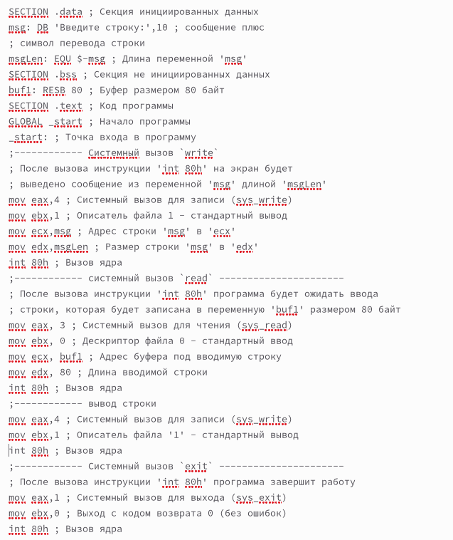

---
## Front matter
title: "Лабораторная работа №5"
subtitle: ". Основы работы с
Midnight Commander (mc). Структура программы на
языке ассемблера NASM. Системные вызовы в ОС
GNU Linux
"
author: "Бунин Арсений Викторович"

## Generic otions
lang: ru-RU
toc-title: "Содержание"

## Bibliography
bibliography: bib/cite.bib
csl: pandoc/csl/gost-r-7-0-5-2008-numeric.csl

## Pdf output format
toc: true # Table of contents
toc-depth: 2
lof: true # List of figures
lot: true # List of tables
fontsize: 12pt
linestretch: 1.5
papersize: a4
documentclass: scrreprt
## I18n polyglossia
polyglossia-lang:
  name: russian
  options:
	- spelling=modern
	- babelshorthands=true
polyglossia-otherlangs:
  name: english
## I18n babel
babel-lang: russian
babel-otherlangs: english
## Fonts
mainfont: PT Serif
romanfont: PT Serif
sansfont: PT Sans
monofont: PT Mono
mainfontoptions: Ligatures=TeX
romanfontoptions: Ligatures=TeX
sansfontoptions: Ligatures=TeX,Scale=MatchLowercase
monofontoptions: Scale=MatchLowercase,Scale=0.9
## Biblatex
biblatex: true
biblio-style: "gost-numeric"
biblatexoptions:
  - parentracker=true
  - backend=biber
  - hyperref=auto
  - language=auto
  - autolang=other*
  - citestyle=gost-numeric
## Pandoc-crossref LaTeX customization
figureTitle: "Рис."
tableTitle: "Таблица"
listingTitle: "Листинг"
lofTitle: "Список иллюстраций"
lotTitle: "Список таблиц"
lolTitle: "Листинги"
## Misc options
indent: true
header-includes:
  - \usepackage{indentfirst}
  - \usepackage{float} # keep figures where there are in the text
  - \floatplacement{figure}{H} # keep figures where there are in the text
---

# Цель работы

Приобретение практических навыков работы в Midnight Commander. Освоение инструкций
языка ассемблера mov и int.

# Задание
1. Создать папку и файл на языке Ассемблер в ней с помощью Midnight Commander
2. Создать файл на языке Ассемблер, принимающий на вход строку 
3. Загрузить файлы на github

# Теоретическое введение

Midnight Commander (или просто mc) — это программа, которая позволяет просматривать
структуру каталогов и выполнять основные операции по управлению файловой системой,
т.е. mc является файловым менеджером. Midnight Commander позволяет сделать работу с
файлами более удобной и наглядной.
Для активации оболочки Midnight Commander достаточно ввести в командной строке mc и
нажать клавишу Enter (рис. 5.1).
В Midnight Commander используются функциональные клавиши F1 — F10 , к которым
привязаны часто выполняемые операции

Программа на языке ассемблера NASM, как правило, состоит из трёх секций: секция кода
программы (SECTION .text), секция инициированных (известных во время компиляции)
данных (SECTION .data) и секция неинициализированных данных (тех, под которые во
время компиляции только отводится память, а значение присваивается в ходе выполнения
программы) (SECTION .bss).

Инструкция языка ассемблера mov предназначена для дублирования данных источника в
приёмнике. Инструкция языка ассемблера int предназначена для вызова прерывания с указанным
номером.

# Выполнение лабораторной работы

Открываем терминал и запускаем Midnight Commander(рис. @fig:fig1).

{#fig:fig1 width=70%}

Переходим в каталог курса (рис. @fig:fig2).

{#fig:fig2 width=70%}

Создаем папку для пятой лабораторной работы (рис. @fig:fig3).

{#fig:fig3 width=70%}

Создаем файл lab5-1.asm в новой папке (рис. @fig:fig4).

{#fig:fig4 width=70%}

Записываем код в файл в редакторе mcedit (рис. @fig:fig5)

{#fig:fig5 width=70%}

Проверяем файл в режиме просмотра  (рис. @fig:fig6)

{#fig:fig6 width=70%}

Выполняем линковку и компоновку  (рис. @fig:fig7)

{#fig:fig7 width=70%}

Результат работы программы(рис. @fig:fig8)

{#fig:fig8 width=70%}

Переименовываем файл в lab5-1.asm(рис. @fig:fig9)

{#fig:fig9 width=70%}

Записываем код второй программы в файл(рис. @fig:fig10)

{#fig:fig10 width=70%}

Результат работы второй программы(рис. @fig:fig11)

{#fig:fig11 width=70%}

Результат работы измененной второй программы. Теперь ввод текста происходит на строке с текстовым сообщением, а не на новой строке(рис. @fig:fig12)

{#fig:fig12 width=70%}

# Самостоятельная работа

1. Создайте копию файла lab5-1.asm. Внесите изменения в программу (без использования внешнего файла in_out.asm), так чтобы она работала по следующему алгоритму:
• вывести приглашение типа “Введите строку:”;
• ввести строку с клавиатуры;
• вывести введённую строку на экран.

2. Получите исполняемый файл и проверьте его работу. На приглашение ввести строку
введите свою фамилию.

Текст третьей программы (рис. @fig:fig15)

{#fig:fig15 width=70%}

Результат работы третьей программы (рис. @fig:fig13)

{#fig:fig13 width=70%}

3. Создайте копию файла lab5-2.asm. Исправьте текст программы с использование подпрограмм из внешнего файла in_out.asm, так чтобы она работала по следующему
алгоритму:
• вывести приглашение типа “Введите строку:”;
• ввести строку с клавиатуры;
• вывести введённую строку на экран.
Не забудьте, подключаемый файл in_out.asm должен лежать в том же каталоге, что и
файл с программой, в которой он используется.
4. Создайте исполняемый файл и проверьте его работу.

Текст четвертой программы (рис. @fig:fig16)

{#fig:fig16 width=70%}

Результат работы четвертой программы (рис. @fig:fig14)

{#fig:fig14 width=70%}

# Выводы

Освоили работу с Midnight Commander и научились использовать команды int и mov языка Assembler

# Список литературы{.unnumbered}

::: {#refs}
:::
