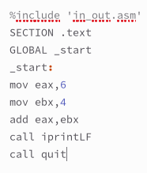
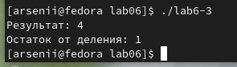

---
## Front matter
title: "Лабораторная работа №6"
subtitle: "Арифметические
операции в NASM"
author: "Бунин Арсений Викторович"

## Generic otions
lang: ru-RU
toc-title: "Содержание"

## Bibliography
bibliography: bib/cite.bib
csl: pandoc/csl/gost-r-7-0-5-2008-numeric.csl

## Pdf output format
toc: true # Table of contents
toc-depth: 2
lof: true # List of figures
lot: true # List of tables
fontsize: 12pt
linestretch: 1.5
papersize: a4
documentclass: scrreprt
## I18n polyglossia
polyglossia-lang:
  name: russian
  options:
	- spelling=modern
	- babelshorthands=true
polyglossia-otherlangs:
  name: english
## I18n babel
babel-lang: russian
babel-otherlangs: english
## Fonts
mainfont: PT Serif
romanfont: PT Serif
sansfont: PT Sans
monofont: PT Mono
mainfontoptions: Ligatures=TeX
romanfontoptions: Ligatures=TeX
sansfontoptions: Ligatures=TeX,Scale=MatchLowercase
monofontoptions: Scale=MatchLowercase,Scale=0.9
## Biblatex
biblatex: true
biblio-style: "gost-numeric"
biblatexoptions:
  - parentracker=true
  - backend=biber
  - hyperref=auto
  - language=auto
  - autolang=other*
  - citestyle=gost-numeric
## Pandoc-crossref LaTeX customization
figureTitle: "Рис."
tableTitle: "Таблица"
listingTitle: "Листинг"
lofTitle: "Список иллюстраций"
lotTitle: "Список таблиц"
lolTitle: "Листинги"
## Misc options
indent: true
header-includes:
  - \usepackage{indentfirst}
  - \usepackage{float} # keep figures where there are in the text
  - \floatplacement{figure}{H} # keep figures where there are in the text
---

# Цель работы

Освоение арифметических инструкций языка ассемблера NASM

# Задание
1. Создать файл на языке Ассемблер, выводящий значения регистра
2. Создать файл на языке Ассемблер, выполняющий арифметические операции
3. Выполнить индивидуальное задание по написанию программы на Ассемблере
4. Загрузить файлы на github

# Теоретическое введение

Схема команды целочисленного сложения add (от англ. addition - добавление) выполняет
сложение двух операндов и записывает результат по адресу первого операнда. Команда add
работает как с числами со знаком, так и без знака. Команда целочисленного вычитания sub (от англ. subtraction – вычитание) работает аналогично команде add
Довольно часто при написании программ встречается операция прибавления или вычитания единицы. Прибавление единицы называется инкрементом, а вычитание — декрементом.
Для этих операций существуют специальные команды: inc (от англ. increment) и dec (от англ.
decrement), которые увеличивают и уменьшают на 1 свой операнд.
Умножение и деление, в отличии от сложения и вычитания, для знаковых и беззнаковых
чисел производиться по-разному, поэтому существуют различные команды.
Для беззнакового умножения используется команда mul.
Для знакового умножения используется команда imul.
Для деления, как и для умножения, существует 2 команды div и
idiv.

# Выполнение лабораторной работы

Создаем исполняемый файл(рис. @fig:fig1 и рис. @fig:fig2)

{#fig:fig1 width=70%}

{#fig:fig2 width=70%}

Результат работы программы (рис. @fig:fig3).

{#fig:fig3 width=70%}

Заменяем символы на цифры в программе (рис. @fig:fig4).

{#fig:fig4 width=70%}

Программа с подключенными внешними функциями (рис. @fig:fig5)

{#fig:fig5 width=70%}

Результат работы программы (рис. @fig:fig6)

{#fig:fig6 width=70%}

Заменяем символы на цифры в программе (рис. @fig:fig7)

{#fig:fig7 width=70%}

Результат работы программы(рис. @fig:fig8)

{#fig:fig8 width=70%}

Код программы, считающей значение выражения (5*2 + 3)/3(рис. @fig:fig9)

{#fig:fig9 width=70%}

Результат работы программы(рис. @fig:fig10)

{#fig:fig10 width=70%}

Код программы, считающей значение выражения (4*6 + 2)/5(рис. @fig:fig11)

{#fig:fig11 width=70%}

Результат работы программы (рис. @fig:fig12)

{#fig:fig12 width=70%}

Результат работы программы, выводящей номер варианта по номеру студенческого билета (рис. @fig:fig13)

{#fig:fig13 width=70%}

# Самостоятельная работа

Написать программу вычисления выражения y=f(x)
Программа должна выводить выражение для вычисления, выводить запрос на ввод значения x, вычислять заданное выражение в зависимости от введенного x, выводить результат вычислений.
Вид функции f(x)=(x/3+5)*7
Создайте исполняемый файл и проверьте его работу для значений 3 и 9

Код программы(рис. @fig:fig14)

{#fig:fig14 width=70%}

Результат работы программы (рис. @fig:fig15)

{#fig:fig15 width=70%}

# Выводы

Освоили арифметические инструкции языка ассемблера NASM

# Список литературы{.unnumbered}

::: {#refs}
:::
