---
## Front matter
title: "Лабораторная работа №7"
subtitle: "Команды безусловного и
условного переходов в Nasm. Программирование
ветвлений"
author: "Бунин Арсений Викторович"

## Generic otions
lang: ru-RU
toc-title: "Содержание"

## Bibliography
bibliography: bib/cite.bib
csl: pandoc/csl/gost-r-7-0-5-2008-numeric.csl

## Pdf output format
toc: true # Table of contents
toc-depth: 2
lof: true # List of figures
lot: true # List of tables
fontsize: 12pt
linestretch: 1.5
papersize: a4
documentclass: scrreprt
## I18n polyglossia
polyglossia-lang:
  name: russian
  options:
	- spelling=modern
	- babelshorthands=true
polyglossia-otherlangs:
  name: english
## I18n babel
babel-lang: russian
babel-otherlangs: english
## Fonts
mainfont: PT Serif
romanfont: PT Serif
sansfont: PT Sans
monofont: PT Mono
mainfontoptions: Ligatures=TeX
romanfontoptions: Ligatures=TeX
sansfontoptions: Ligatures=TeX,Scale=MatchLowercase
monofontoptions: Scale=MatchLowercase,Scale=0.9
## Biblatex
biblatex: true
biblio-style: "gost-numeric"
biblatexoptions:
  - parentracker=true
  - backend=biber
  - hyperref=auto
  - language=auto
  - autolang=other*
  - citestyle=gost-numeric
## Pandoc-crossref LaTeX customization
figureTitle: "Рис."
tableTitle: "Таблица"
listingTitle: "Листинг"
lofTitle: "Список иллюстраций"
lotTitle: "Список таблиц"
lolTitle: "Листинги"
## Misc options
indent: true
header-includes:
  - \usepackage{indentfirst}
  - \usepackage{float} # keep figures where there are in the text
  - \floatplacement{figure}{H} # keep figures where there are in the text
---

# Цель работы

Изучение команд условного и безусловного переходов. Приобретение навыков написания
программ с использованием переходов. Знакомство с назначением и структурой файла
листинга

# Задание
1. Создать файл на языке Ассемблер, выводящий текст с использованием jmp
2. Создать файл на языке Ассемблер, сравнивающий числа с использованием jmp
3. Выполнить индивидуальное задание по написанию программы на Ассемблере
4. Загрузить файлы на github

# Теоретическое введение
Безусловный переход выполняется инструкцией jmp, которая
включает в себя адрес перехода, куда следует передать управление
для условного перехода необходима проверка какого-либо условия.
В ассемблере команды условного перехода вычисляют условие перехода анализируя флаги
из регистра флагов.
Флаг – это бит, принимающий значение 1 («флаг установлен»), если выполнено некоторое
условие, и значение 0 («флаг сброшен») в противном случае. Флаги работают независимо
друг от друга, и лишь для удобства они помещены в единый регистр — регистр флагов, отражающий текущее состояние процессора
Листинг (в рамках понятийного аппарата NASM) — это один из выходных файлов, создаваемых транслятором. Он имеет текстовый вид и нужен при отладке программы, так как
кроме строк самой программы он содержит дополнительную информацию

# Выполнение лабораторной работы

Создаем исполняемый файл(рис. @fig:fig1)

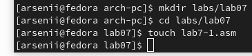{#fig:fig1 width=70%}

Код программы, выводящей строки в определенной последовательности(рис. @fig:fig2)

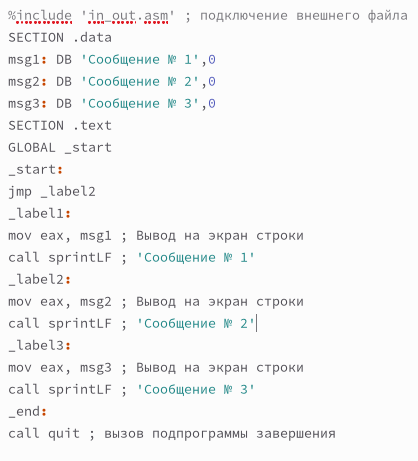{#fig:fig2 width=70%}

Результат работы программы(рис. @fig:fig3)

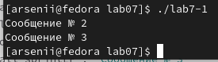{#fig:fig3 width=70%}

Измененный текст программы (рис. @fig:fig4).

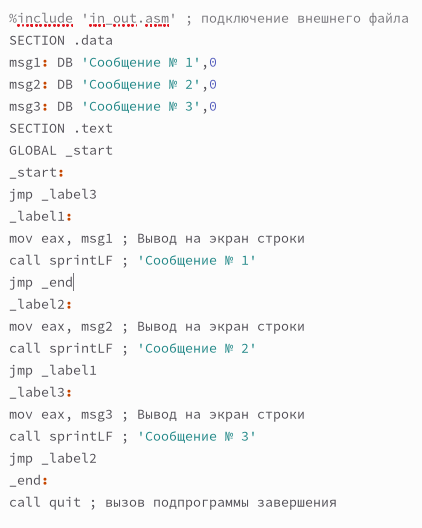{#fig:fig4 width=70%}

Результат работы программы, выводящий строки в другой последовательности(рис. @fig:fig5).

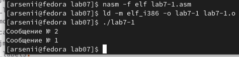{#fig:fig5 width=70%}

Программа, выводящая строки в обратной последовательности (рис. @fig:fig6)

{#fig:fig6 width=70%}

Результат работы программы(рис. @fig:fig7)

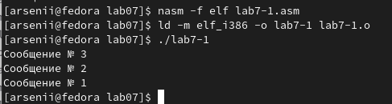{#fig:fig7 width=70%}

 Результат работы программы, сравнивающей числа(рис. @fig:fig8)

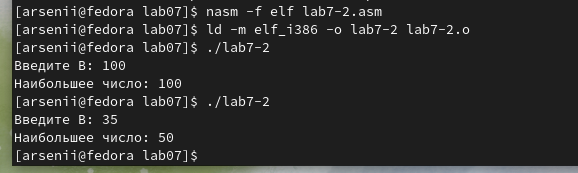{#fig:fig8 width=70%}

При выполнении данной команды (рис. @fig:fig9) создается файл с расширением lst. В файл добавляются все встроенные библиотеки, номера строк, адрес и машинный код каждой команды

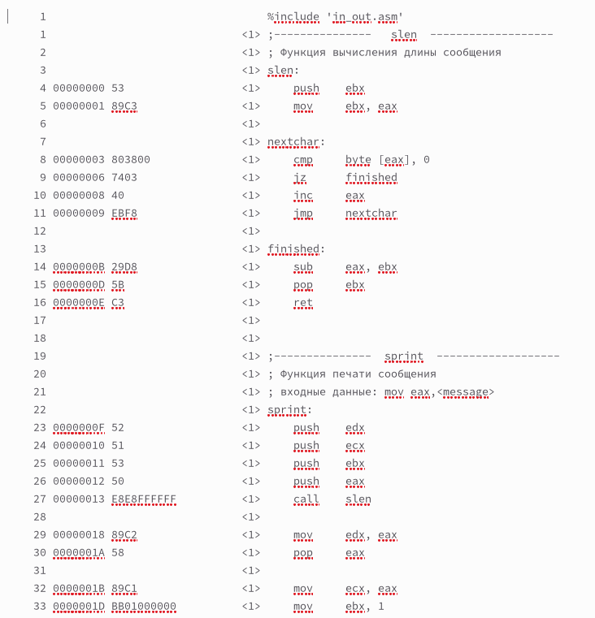{#fig:fig9 width=70%}

# Самостоятельная работа

1. Напишите программу нахождения наименьшей из 3 целочисленных переменных a,b и c.
Значения переменных выбрать из в соответствии с вариантом, полученным
при выполнении лабораторной работы № 7. Создайте исполняемый файл и проверьте
его работу.

Код программы(рис. @fig:fig10 и рис. @fig:fig11)

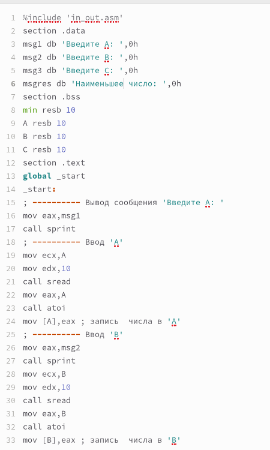{#fig:fig10 width=70%}

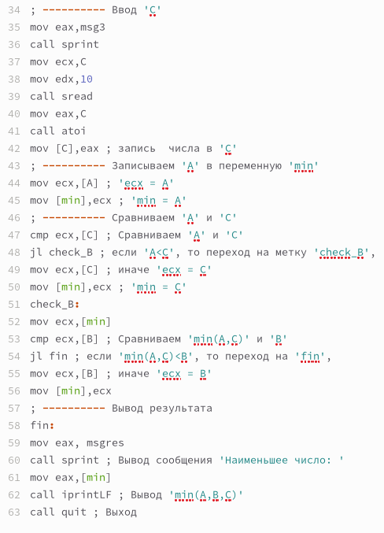{#fig:fig11 width=70%}

Результат работы программы (рис. @fig:fig12)

{#fig:fig12 width=70%}

2. Напишите программу, которая для введенных с клавиатуры значений x и a вычисляет
значение заданной функции f(x) и выводит результат вычислений. Вид функции f(x)
выбрать из таблицы 7.6 вариантов заданий в соответствии с вариантом, полученным
при выполнении лабораторной работы № 7. Создайте исполняемый файл и проверьте
его работу для значений x и a из 7.6

Код программы(рис. @fig:fig13)

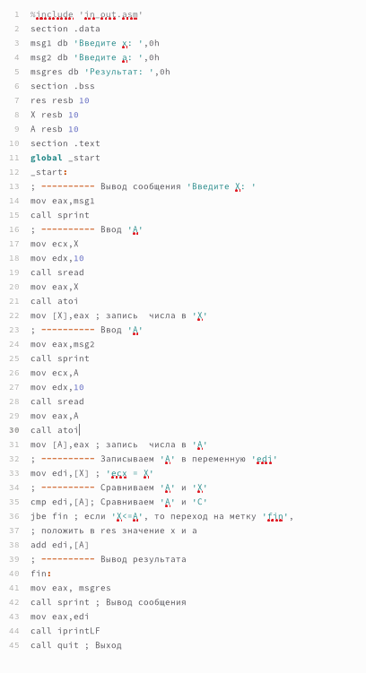{#fig:fig13 width=70%}

Результат работы программы (рис. @fig:fig14)

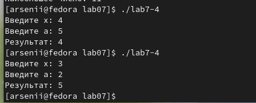{#fig:fig14 width=70%}

# Выводы

Изучили команды условного и безусловного переходов. Приобрели навыки написания
программ с использованием переходов. Ознакомились с назначением и структурой файла
листинга.

# Список литературы{.unnumbered}

::: {#refs}
:::
