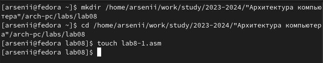
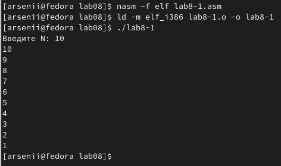
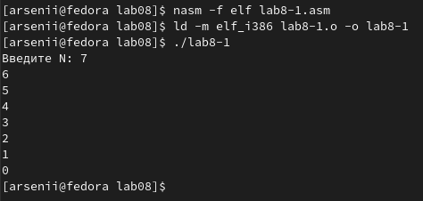
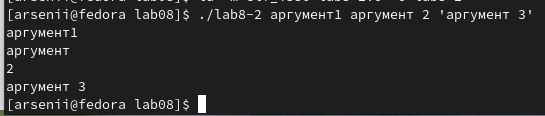
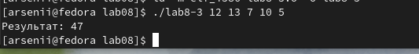
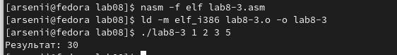
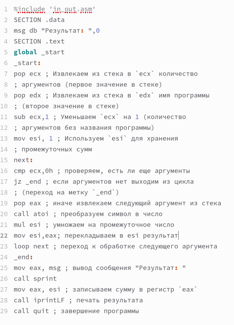
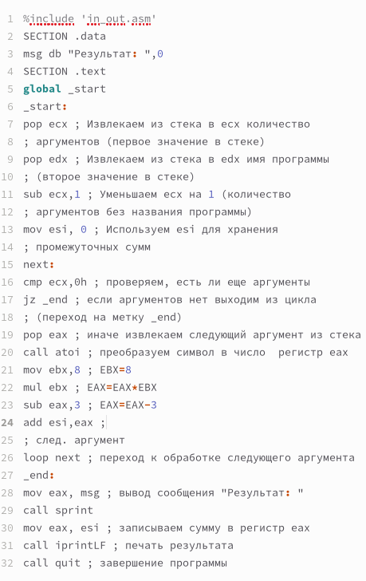
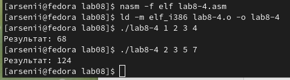

---
## Front matter
title: "Лабораторная работа №8"
subtitle: "Программирование
цикла. Обработка аргументов командной строки"
author: "Бунин Арсений Викторович"

## Generic otions
lang: ru-RU
toc-title: "Содержание"

## Bibliography
bibliography: bib/cite.bib
csl: pandoc/csl/gost-r-7-0-5-2008-numeric.csl

## Pdf output format
toc: true # Table of contents
toc-depth: 2
lof: true # List of figures
lot: true # List of tables
fontsize: 12pt
linestretch: 1.5
papersize: a4
documentclass: scrreprt
## I18n polyglossia
polyglossia-lang:
  name: russian
  options:
	- spelling=modern
	- babelshorthands=true
polyglossia-otherlangs:
  name: english
## I18n babel
babel-lang: russian
babel-otherlangs: english
## Fonts
mainfont: PT Serif
romanfont: PT Serif
sansfont: PT Sans
monofont: PT Mono
mainfontoptions: Ligatures=TeX
romanfontoptions: Ligatures=TeX
sansfontoptions: Ligatures=TeX,Scale=MatchLowercase
monofontoptions: Scale=MatchLowercase,Scale=0.9
## Biblatex
biblatex: true
biblio-style: "gost-numeric"
biblatexoptions:
  - parentracker=true
  - backend=biber
  - hyperref=auto
  - language=auto
  - autolang=other*
  - citestyle=gost-numeric
## Pandoc-crossref LaTeX customization
figureTitle: "Рис."
tableTitle: "Таблица"
listingTitle: "Листинг"
lofTitle: "Список иллюстраций"
lotTitle: "Список таблиц"
lolTitle: "Листинги"
## Misc options
indent: true
header-includes:
  - \usepackage{indentfirst}
  - \usepackage{float} # keep figures where there are in the text
  - \floatplacement{figure}{H} # keep figures where there are in the text
---

# Цель работы

Приобретение навыков написания программ с использованием циклов и обработкой
аргументов командной строки.

# Задание
1. Создать файл на языке Ассемблер, выводящий убывающий ряд цифр с использованием цикла
2. Создать файл на языке Ассемблер, выводящий введенные аргументы
3. Создать файл на языке Ассемблер, складывающий и перемножающий введенные числа
4. Выполнить индивидуальное задание по написанию программы на Ассемблере
5. Загрузить файлы на github

# Теоретическое введение

Стек — это структура данных, организованная по принципу LIFO («Last In — First Out»
или «последним пришёл — первым ушёл»). Стек является частью архитектуры процессора и
реализован на аппаратном уровне. Для работы со стеком в процессоре есть специальные
регистры (ss, bp, sp) и команды.
Основной функцией стека является функция сохранения адресов возврата и передачи
аргументов при вызове процедур. Кроме того, в нём выделяется память для локальных
переменных и могут временно храниться значения регистров

Для стека существует две основные операции: добавление элемента в вершину стека (push) и извлечение элемента из вершины стека (pop).

Для организации циклов существуют специальные инструкции. Для всех инструкций
максимальное количество проходов задаётся в регистре ecx. Наиболее простой является инструкция loop. Она позволяет организовать безусловный цикл

# Выполнение лабораторной работы

Создаем исполняемый файл(рис. @fig:fig1) (рис. @fig:fig2)

{#fig:fig1 width=70%}

Результат работы программы, выводящей убывающий ряд чисел(рис. @fig:fig2)

{#fig:fig2 width=70%}

При изменении кода программы она выходит в бесконечный цикл

При добавлении в программу записи значений и выгрузку в/из стека работа программы корректна (рис. @fig:fig3).

{#fig:fig3 width=70%}

Результат работы программы, принимающей на вход аргументы в виде строки и выводящей их на экран. Аргументы разделяются пробелом или заключаются в кавычки (рис. @fig:fig4).

{#fig:fig4 width=70%}

Результат работы программы, складывающей числа(рис. @fig:fig5)

{#fig:fig5 width=70%}

Результат работы программы, перемножающей числа(рис. @fig:fig6)

{#fig:fig6 width=70%}

Текст программы, перемножающей числа (рис. @fig:fig7)

{#fig:fig7 width=70%}

# Самостоятельная работа
Напишите программу, которая находит сумму значений функции для нескольких 
введенных аргументов. Функция имеет вид f(x) = 8x-3

Код программы(рис. @fig:fig8)

{#fig:fig8 width=70%}

Результат работы программы (рис. @fig:fig9)

{#fig:fig9 width=70%}

# Выводы

Освоили написание программ с использованием циклов и обработкой
аргументов командной строки

# Список литературы{.unnumbered}

::: {#refs}
:::
