---
## Front matter
title: "Лабораторная работа №9"
subtitle: "Понятие подпрограммы.
Отладчик GDB"
author: "Бунин Арсений Викторович"

## Generic otions
lang: ru-RU
toc-title: "Содержание"

## Bibliography
bibliography: bib/cite.bib
csl: pandoc/csl/gost-r-7-0-5-2008-numeric.csl

## Pdf output format
toc: true # Table of contents
toc-depth: 2
lof: true # List of figures
lot: true # List of tables
fontsize: 12pt
linestretch: 1.5
papersize: a4
documentclass: scrreprt
## I18n polyglossia
polyglossia-lang:
  name: russian
  options:
	- spelling=modern
	- babelshorthands=true
polyglossia-otherlangs:
  name: english
## I18n babel
babel-lang: russian
babel-otherlangs: english
## Fonts
mainfont: PT Serif
romanfont: PT Serif
sansfont: PT Sans
monofont: PT Mono
mainfontoptions: Ligatures=TeX
romanfontoptions: Ligatures=TeX
sansfontoptions: Ligatures=TeX,Scale=MatchLowercase
monofontoptions: Scale=MatchLowercase,Scale=0.9
## Biblatex
biblatex: true
biblio-style: "gost-numeric"
biblatexoptions:
  - parentracker=true
  - backend=biber
  - hyperref=auto
  - language=auto
  - autolang=other*
  - citestyle=gost-numeric
## Pandoc-crossref LaTeX customization
figureTitle: "Рис."
tableTitle: "Таблица"
listingTitle: "Листинг"
lofTitle: "Список иллюстраций"
lotTitle: "Список таблиц"
lolTitle: "Листинги"
## Misc options
indent: true
header-includes:
  - \usepackage{indentfirst}
  - \usepackage{float} # keep figures where there are in the text
  - \floatplacement{figure}{H} # keep figures where there are in the text
---

# Цель работы

Приобретение навыков написания программ с использованием подпрограмм. Знакомство
с методами отладки при помощи GDB и его основными возможностями.

# Задание
1. Реализация подпрограмм в NASM
2. Отладка программ с помощью GDB
3. Выполнить индивидуальное задание по отладке программы на Ассемблере
4. Загрузить файлы на github

# Теоретическое введение

Отладчик GDB (как и любой другой отладчик) позволяет увидеть, что происходит «внутри»
программы в момент её выполнения или что делает программа в момент сбоя.
GDB может выполнять следующие действия:
* начать выполнение программы, задав всё, что может повлиять на её поведение;
* остановить программу при указанных условиях;
* исследовать, что случилось, когда программа остановилась;
* изменить программу так, чтобы можно было поэкспериментировать с устранением
эффектов одной ошибки и продолжить выявление других.

Подпрограмма — это, как правило, функционально законченный участок кода, который
можно многократно вызывать из разных мест программы. В отличие от простых переходов
из подпрограмм существует возврат на команду, следующую за вызовом.
Если в программе встречается одинаковый участок кода, его можно оформить в виде
подпрограммы, а во всех нужных местах поставить её вызов. При этом подпрограмма будет содержаться в коде в одном экземпляре, что позволит уменьшить размер кода всей
программы.

# Выполнение лабораторной работы

Запустили исполняемый файл в отладчике gdb(рис. @fig:fig1)

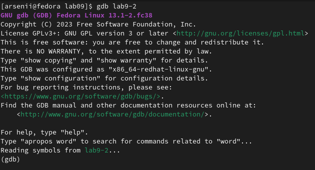{#fig:fig1 width=70%}

Проверили работу программы в отладчике(рис. @fig:fig2)

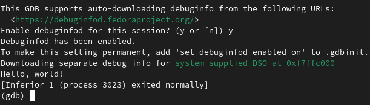{#fig:fig2 width=70%}

Установили первую точку останова (рис. @fig:fig3).

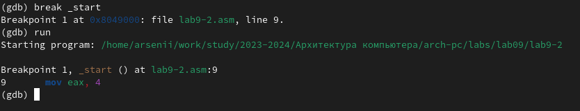{#fig:fig3 width=70%}

 Дизассемблирование программы, начиная с точки старта(рис. @fig:fig4).

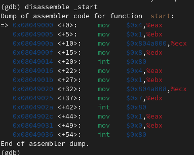{#fig:fig4 width=70%}

Дизассемблированный код программы со стилем Интел(рис. @fig:fig5)

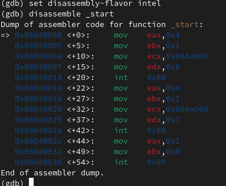{#fig:fig5 width=70%}

Переход в псевдографический режим (рис. @fig:fig6)

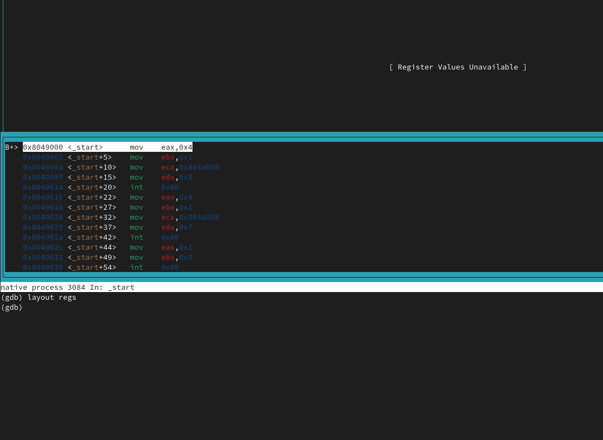{#fig:fig6 width=70%}

 (рис. @fig:fig7)

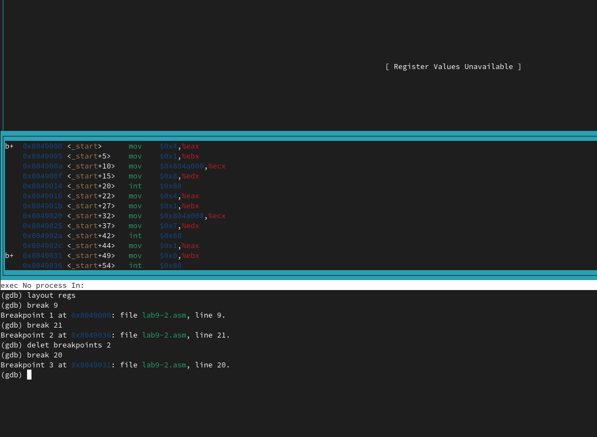{#fig:fig7 width=70%}

Установили вторую точку останова (рис. @fig:fig8)

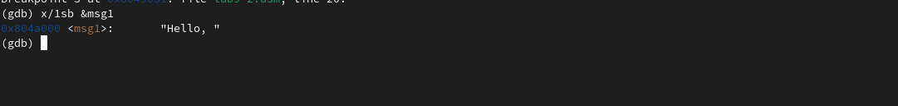{#fig:fig8 width=70%}

Вывод значений переменных (рис. @fig:fig9) (рис. @fig:fig10)

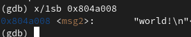{#fig:fig9 width=70%}

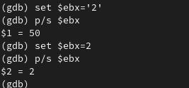{#fig:fig10 width=70%}

 Установка значений переменных в программе. Вывод переменной отличается из-за формата данных(рис. @fig:fig11).

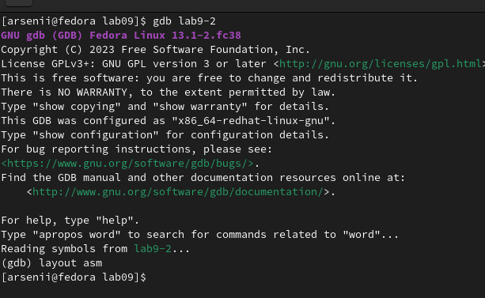{#fig:fig11 width=70%}

Запуск второй программы с аргументами (рис. @fig:fig12)

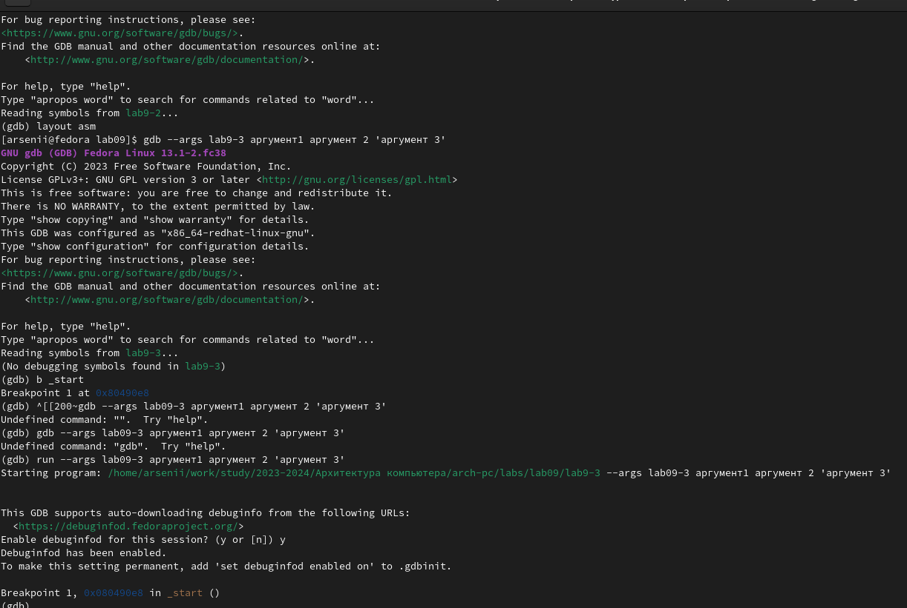{#fig:fig12 width=70%}

Вывод числа аргументов (рис. @fig:fig13)

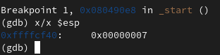{#fig:fig13 width=70%}

Вывод значений аргументов (рис. @fig:fig14)

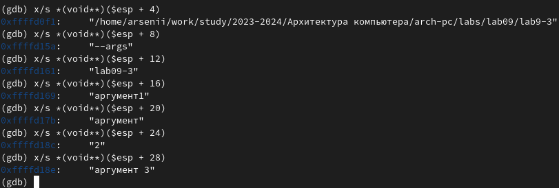{#fig:fig14 width=70%}

# Самостоятельная работа

1. Преобразовать программу из лабораторной работы №8 (Задание №1 для самостоятельной работы), реализовав вычисление значения функции f(x) как подпрограмму

Код программы (рис. @fig:fig15)

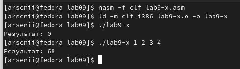{#fig:fig15 width=70%}

Результат работы программы (рис. @fig:fig16)

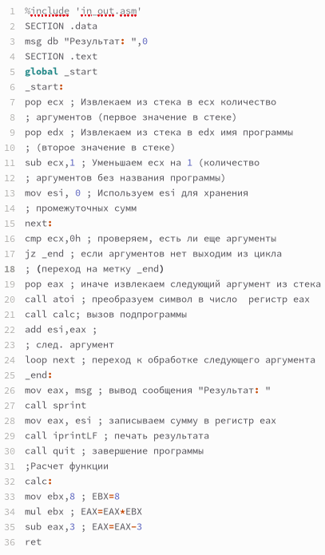{#fig:fig16 width=70%}

2. Отладка программы с помощью GDB Linux

Программа выдает ошибочное значение (рис. @fig:fig18)

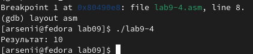{#fig:fig18 width=70%}

В отладчике видим, что умножение происходит в регистре eax, тогда как мы положили значение суммы в регистр ebx. Это видно по значениям регистров eax и ebx(рис. @fig:fig17)

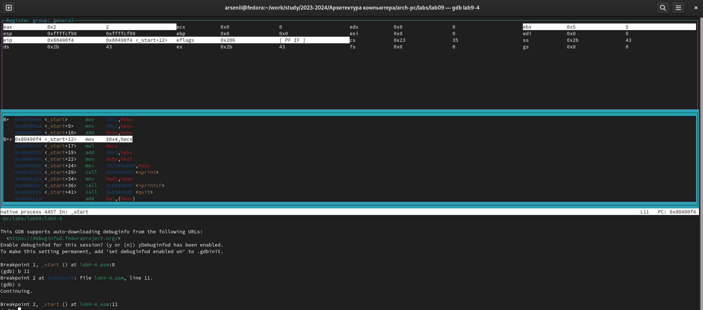{#fig:fig17 width=70%}

Исправленный код программы (рис. @fig:fig20)

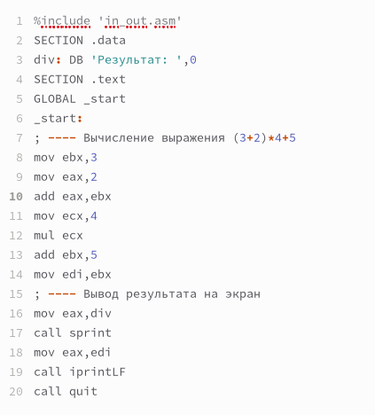{#fig:fig20 width=70%}

Исправленная программа выдает ошибочное значение (рис. @fig:fig18)

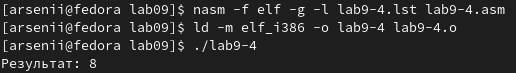{#fig:fig19 width=70%}

В отладчике видим, что второе сложение происходит в регистре ebx, тогда как мы положили значение суммы в регистр eax (рис. @fig:fig21)

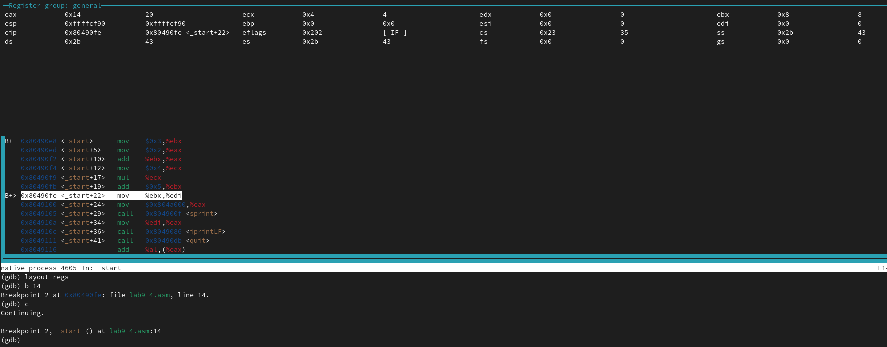{#fig:fig21 width=70%}

Исправленный код программы (рис. @fig:fig23)

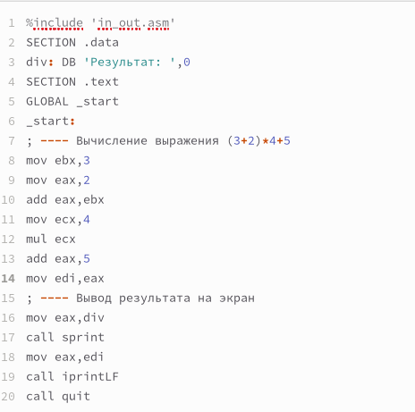{#fig:fig23 width=70%}

Исправленная программа работает корректно (рис. @fig:fig22)

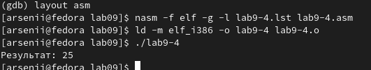{#fig:fig22 width=70%}

# Выводы

Приобрели навыки написания программ с использованием подпрограмм. Познакомились
с методами отладки при помощи GDB и его основными возможностями.

# Список литературы{.unnumbered}

::: {#refs}
:::
