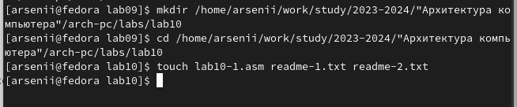
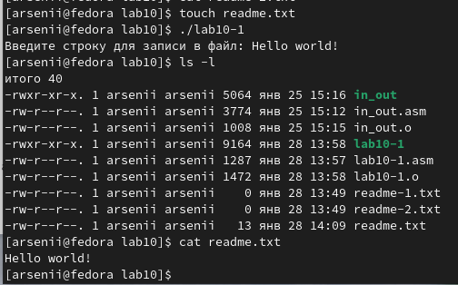
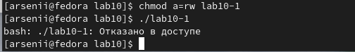
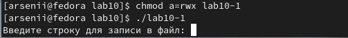
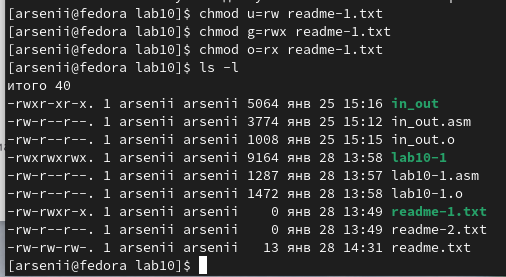
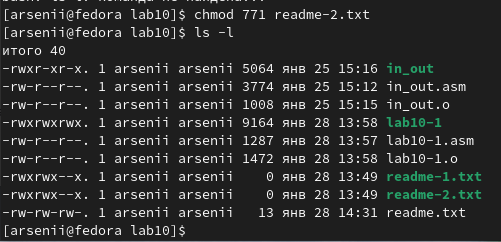
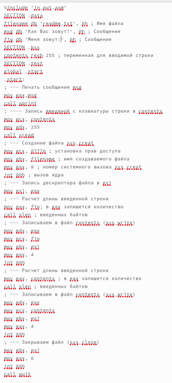
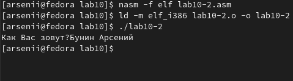
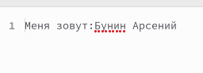

---
## Front matter
title: "Лабораторная работа №10"
subtitle: "Работа с файлами
средствами Nasm"
author: "Бунин Арсений Викторович"

## Generic otions
lang: ru-RU
toc-title: "Содержание"

## Bibliography
bibliography: bib/cite.bib
csl: pandoc/csl/gost-r-7-0-5-2008-numeric.csl

## Pdf output format
toc: true # Table of contents
toc-depth: 2
lof: true # List of figures
lot: true # List of tables
fontsize: 12pt
linestretch: 1.5
papersize: a4
documentclass: scrreprt
## I18n polyglossia
polyglossia-lang:
  name: russian
  options:
	- spelling=modern
	- babelshorthands=true
polyglossia-otherlangs:
  name: english
## I18n babel
babel-lang: russian
babel-otherlangs: english
## Fonts
mainfont: PT Serif
romanfont: PT Serif
sansfont: PT Sans
monofont: PT Mono
mainfontoptions: Ligatures=TeX
romanfontoptions: Ligatures=TeX
sansfontoptions: Ligatures=TeX,Scale=MatchLowercase
monofontoptions: Scale=MatchLowercase,Scale=0.9
## Biblatex
biblatex: true
biblio-style: "gost-numeric"
biblatexoptions:
  - parentracker=true
  - backend=biber
  - hyperref=auto
  - language=auto
  - autolang=other*
  - citestyle=gost-numeric
## Pandoc-crossref LaTeX customization
figureTitle: "Рис."
tableTitle: "Таблица"
listingTitle: "Листинг"
lofTitle: "Список иллюстраций"
lotTitle: "Список таблиц"
lolTitle: "Листинги"
## Misc options
indent: true
header-includes:
  - \usepackage{indentfirst}
  - \usepackage{float} # keep figures where there are in the text
  - \floatplacement{figure}{H} # keep figures where there are in the text
---

# Цель работы

Приобретение навыков написания программ для работы с файлами

# Задание
1. Создать файл на языке Ассемблер, записывающий сообщения в текстовый файл
2. Изменить права доступа к файлам с помощью командной строки
3. Выполнить индивидуальное задание по написанию программы на Ассемблере
4. Загрузить файлы на github

# Теоретическое введение

Права доступа определяют набор действий (чтение, запись, выполнение), разрешённых
для выполнения пользователям системы над файлами. Для каждого файла пользователь
может входить в одну из трех групп: владелец, член группы владельца, все остальные. Для
каждой из этих групп может быть установлен свой набор прав доступа. Владельцем файла
является его создатель

Набор прав доступа задается тройками битов и состоит из прав на чтение, запись и исполнение файла. В символьном представлении он имеет вид строк rwx, где вместо любого
символа может стоять дефис. Всего возможно 8 комбинаций, приведенных в таблице 10.1.
Буква означает наличие права (установлен в единицу второй бит триады r — чтение, первый
бит w — запись, нулевой бит х — исполнение), а дефис означает отсутствие права (нулевое
значение соответствующего бита). Также права доступа могут быть представлены как восьмеричное число. Так, права доступа rw- (чтение и запись, без исполнения) понимаются как
три двоичные цифры 110 или как восьмеричная цифра 6

# Выполнение лабораторной работы

Создаем необходимые файлы и программы(рис. @fig:fig1)

{#fig:fig1 width=70%}

Результат работы программы, вводящей строку в файл (рис. @fig:fig2)

{#fig:fig2 width=70%}

При изменении прав доступа исполнить файл невозможно, так исполнение запрещено (рис. @fig:fig3).

{#fig:fig3 width=70%}

При повторном изменении программа запускается (рис. @fig:fig4).

{#fig:fig4 width=70%}

Изменение прав доступа (вариант задания 19) для первого текстового файла с проверкой (рис. @fig:fig5)

{#fig:fig5 width=70%}

Изменение прав доступа (вариант задания 19) для второго текстового файла другим способом с проверкой(рис. @fig:fig6)

{#fig:fig6 width=70%}

# Самостоятельная работа
Напишите программу работающую по следующему алгоритму:
* Вывод приглашения “Как Вас зовут?”
* ввести с клавиатуры свои фамилию и имя
* создать файл с именем name.txt
* записать в файл сообщение “Меня зовут”
* дописать в файл строку введенную с клавиатуры
* закрыть файл

{#fig:fig7 width=70%}

Результат работы программы (рис. @fig:fig8) и (рис. @fig:fig9)

{#fig:fig8 width=70%}
{#fig:fig9 width=70%}

# Выводы

Приобрели навыки написания программ для работы с файлами

# Список литературы{.unnumbered}

::: {#refs}
:::
